# Cranberry Forge

### Small tools. Expressive worlds.

Independent Three.js game-development tools, interactive workbenches, and playable starter games by [CranberryClock](https://github.com/CranberryClock).

[](https://github.com/CranberryClock/Cranberry-Forge/actions/workflows/check.yml)
[](https://threejs.org/)
[](LICENSE)

[Live showcases](https://cranberryclock.com/forge/) · [Quick start](#quick-start) · [15 tools](#toolbox) · [2 game templates](#game-templates) · [Documentation](#documentation)

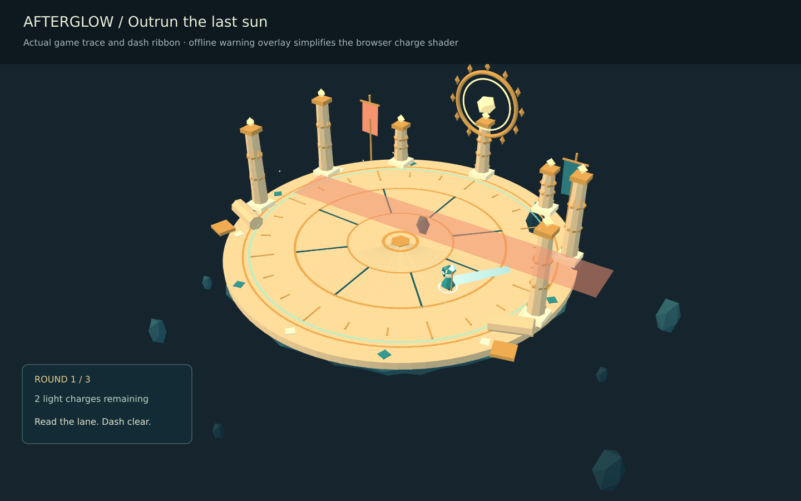

Build landscapes, readable combat, responsive motion, and the systems that make a game feel complete. Choose one package or compose several: **no tool requires another Forge tool**, and every package includes ES modules, TypeScript declarations, tests, and an integration guide.

## Try the demos

Explore **[Cranberry Forge on CranberryClock](https://cranberryclock.com/forge/)** for interactive showcases, playable templates, and package downloads. The gallery is part of the CranberryClock portfolio; this public repository is the home for source, documentation, and issues.

The hosted demos run in your browser with no local installation. A modern WebGL2-capable browser is needed for the 3D scenes. Node.js is used for local development and the optional companion API, not by the static host.

| Showcase | Open in your browser |
| --- | --- |
| Biome | [Launch demo](https://cranberryclock.com/forge/showcase/index.html#biome) |
| Flux | [Launch demo](https://cranberryclock.com/forge/showcase/index.html#flux) |
| Signal | [Launch demo](https://cranberryclock.com/forge/showcase/signal.html) |
| Latch | [Launch demo](https://cranberryclock.com/forge/showcase/latch.html) |
| Loom | [Launch demo](https://cranberryclock.com/forge/showcase/loom.html) |
| Satchel | [Launch demo](https://cranberryclock.com/forge/showcase/play.html?kit=satchel) |
| Chatter | [Launch demo](https://cranberryclock.com/forge/showcase/play.html?kit=chatter) |
| Trailmark | [Launch demo](https://cranberryclock.com/forge/showcase/trailmark.html) |
| Wayfinder | [Launch demo](https://cranberryclock.com/forge/showcase/wayfinder.html) |
| Spring | [Launch demo](https://cranberryclock.com/forge/showcase/spring.html) |
| Parcel | [Launch demo](https://cranberryclock.com/forge/showcase/parcel.html) |
| Tempo | [Launch demo](https://cranberryclock.com/forge/showcase/tempo.html) |
| Mothlight game template | [Launch demo](https://cranberryclock.com/forge/showcase/templates/mothlight/) |
| Afterglow game template | [Launch demo](https://cranberryclock.com/forge/showcase/templates/afterglow/) |

Ledger, Keepsake, and Sift are also included in the source release. Run them locally at `/ledger.html`, `/keepsake.html`, and `/sift.html` after following Quick start below. Their hosted demos will become available when the portfolio gallery is updated.

The hosted gallery identifies its source revision. It may lag the latest changes on `main` while a new showcase build is being prepared.

## Quick start

Requires Node.js 22+ and a WebGL2-capable browser.

```sh
git clone https://github.com/CranberryClock/Cranberry-Forge.git cranberry-forge
cd cranberry-forge
npm ci
npm run build
npm run dev
```

Open **http://127.0.0.1:4173/catalog.html** to explore all 15 workbenches and both games. Each showcase includes controls, an integration guide, and package downloads.

### Install just one tool

Packages are **not published to npm yet**. Pack the folder you want and install its archive in your game:

```sh
# From this repository:
npm pack ./dist/packages/biome

# From your game project, using the actual archive path:
npm install three@0.180.0 /path/to/cranberry-forge-biome-0.1.0.tgz
```

```js
import * as THREE from "three";
import { scatter, createInstances } from "@cranberry-forge/biome";

const geometry = new THREE.ConeGeometry(0.6, 2, 7);
geometry.translate(0, 1, 0);
const material = new THREE.MeshStandardMaterial({ color: "#527448" });
const height = (x, z) => Math.sin(x * 0.12) * Math.cos(z * 0.12) * 2;

const field = scatter({ seed: 42, count: 180, radius: 30, minDistance: 1.8 }, height);
const grove = createInstances(field, [{ geometry, material }]);
scene.add(grove); // Use your existing lit Three.js scene and matching terrain.
```

[Biome's complete tutorial](dist/packages/biome/README.md) covers terrain, exclusions, export, and resource cleanup. Replace `biome` with any package below. Headless packages do not require Three.js; rendering packages target Three.js r180 and TypeScript users should install matching `@types/three`.

## Toolbox

| Tool | What it gives your game | Runtime |
| --- | --- | --- |
| [Biome](dist/packages/biome/README.md) | Seeded terrain-aware placement, spacing, exclusions, snapshots, and native GPU instances | Three.js peer |
| [Flux](dist/packages/flux/README.md) | World-space motion ribbons with taper, gradients, lifetime, and teleport breaks | Three.js peer |
| [Signal](dist/packages/signal/README.md) | Circle, ring, cone, and beam warnings with terrain projection and matching hit-area queries | Three.js peer |
| [Latch](dist/packages/latch/README.md) | Contextual focus, actor reach, occlusion, and cancellable hold interactions | Three.js peer |
| [Loom](dist/packages/loom/README.md) | Spline sampling and swept track, ribbon, and border geometry | Three.js peer |
| [Satchel](dist/packages/satchel/README.md) | Grid inventory, stacks, rotation, weight limits, atomic transfers, crafting, and saves | Headless |
| [Chatter](dist/packages/chatter/README.md) | Branching dialogue, variables, conditions, effects, saves, and an optional DOM adapter | Headless |
| [Trailmark](dist/packages/trailmark/README.md) | Event-driven objectives, prerequisites, counters, completion receipts, and saves | Headless |
| [Wayfinder](dist/packages/wayfinder/README.md) | Deterministic weighted-grid A*, terrain edits, corner policies, and snapshots | Headless |
| [Spring](dist/packages/spring/README.md) | Analytic damped springs for responsive motion and game feel | Headless |
| [Parcel](dist/packages/parcel/README.md) | Seeded weighted loot, inspectable odds, and explicit hard pity | Headless |
| [Tempo](dist/packages/tempo/README.md) | Host-clocked ability charges, sequential recharge, and global cooldowns | Headless |

| [Ledger](dist/packages/ledger/README.md) | Equipment stats with modifier explanations, bounds, and loadout comparisons | Headless |
| [Keepsake](dist/packages/keepsake/README.md) | Validated save migrations that preserve the original input, with before-and-after diffs | Headless |
| [Sift](dist/packages/sift/README.md) | Asset manifest checks, budget reports, and a local-file preflight CLI | Headless |

### See them in action

Each image links to its tool's guide. Run the local catalog to interact with the corresponding scene.

| Worldbuilding & effects | Gameplay & motion |
| --- | --- |
| [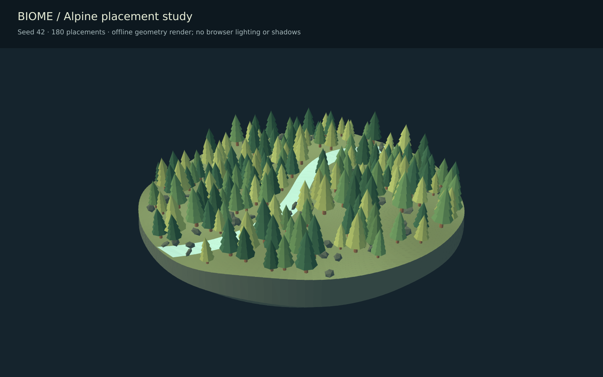](dist/packages/biome/README.md) **Biome · A seed becomes a landscape** | [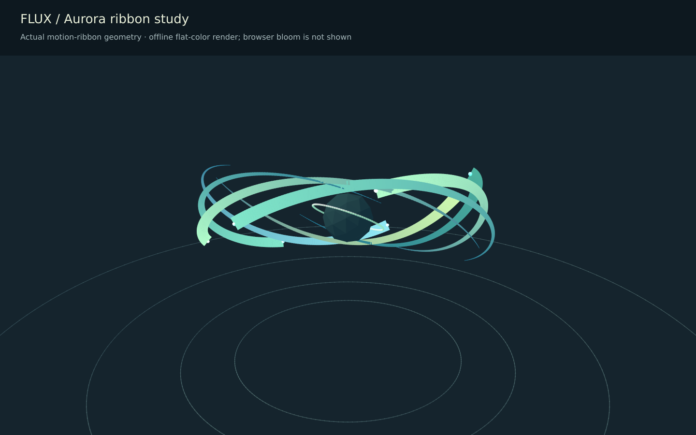](dist/packages/flux/README.md) **Flux · Give movement a memory** |
| [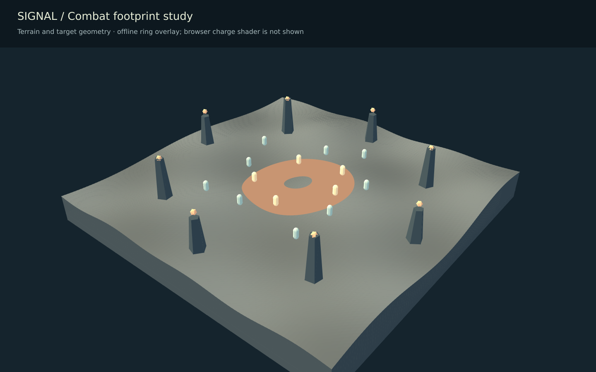](dist/packages/signal/README.md) **Signal · Make danger readable** | [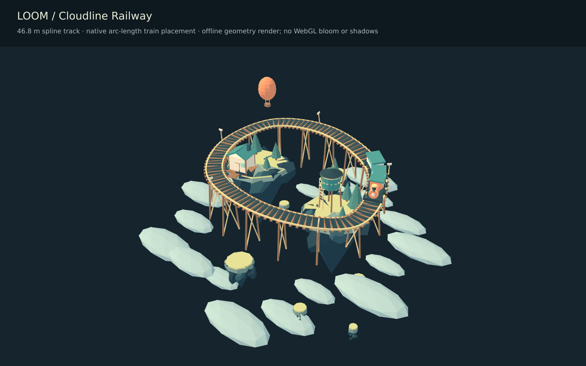](dist/packages/loom/README.md) **Loom · Build the cloudline** |
| [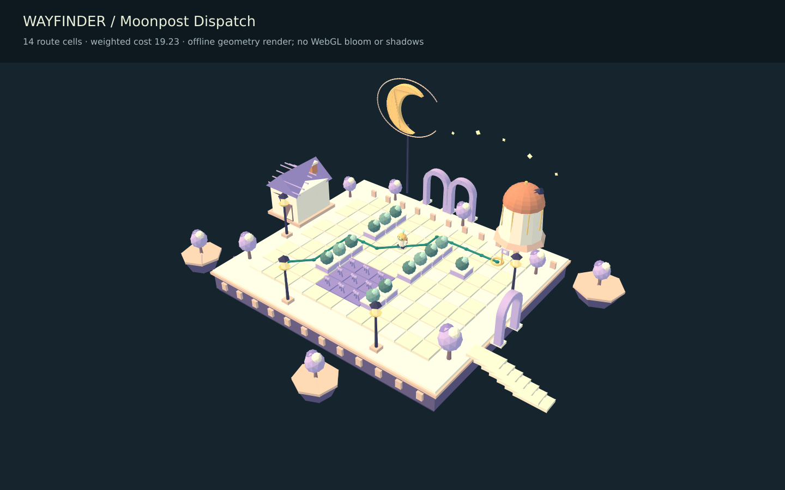](dist/packages/wayfinder/README.md) **Wayfinder · Dispatch the moonpost** | [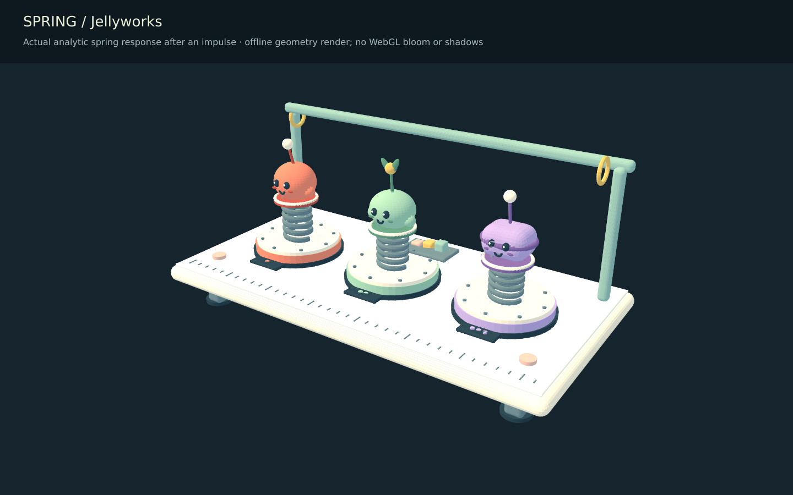](dist/packages/spring/README.md) **Spring · Make movement feel alive** |
| [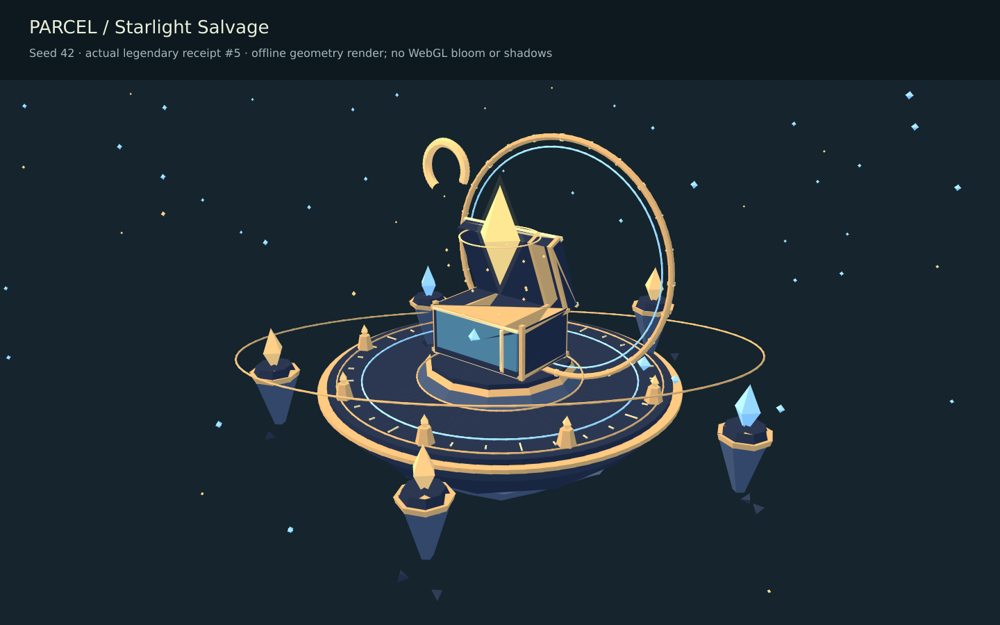](dist/packages/parcel/README.md) **Parcel · Open starlight salvage** | [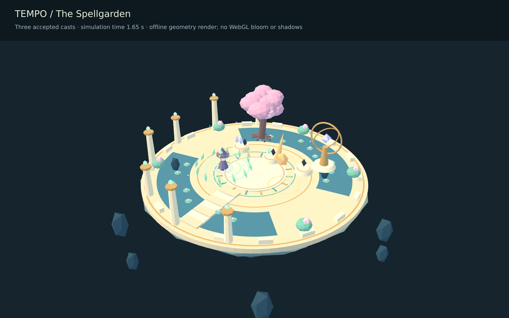](dist/packages/tempo/README.md) **Tempo · Give every spell its moment** |
| [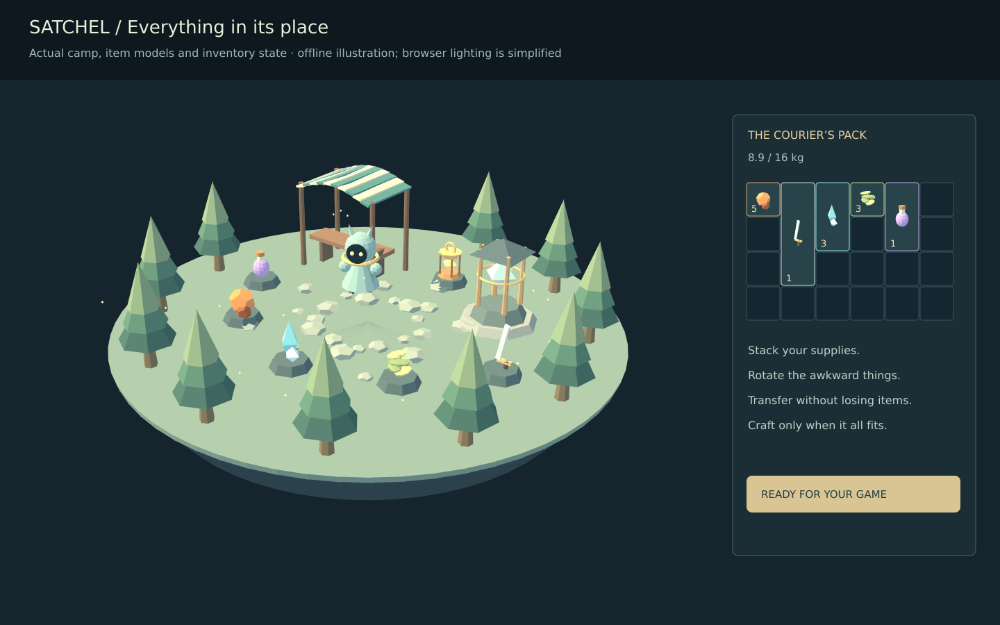](dist/packages/satchel/README.md) **Satchel · Everything in its place** | [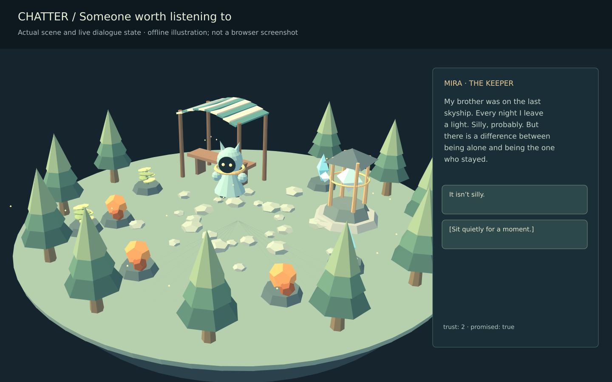](dist/packages/chatter/README.md) **Chatter · Someone worth listening to** |
| [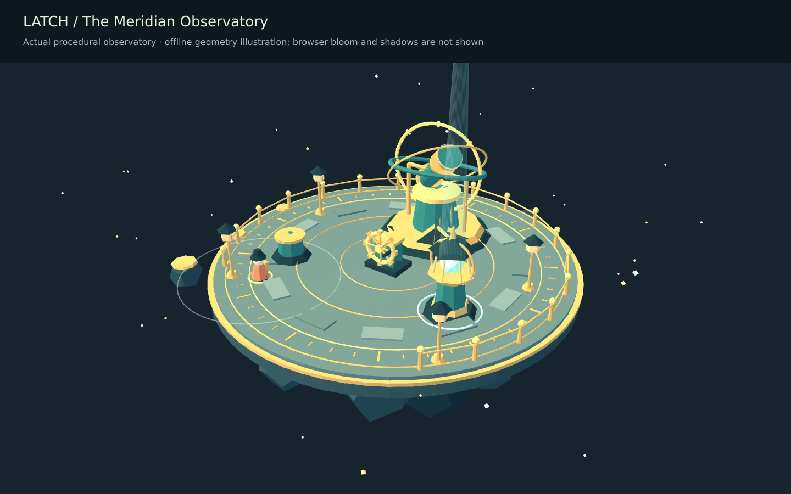](dist/packages/latch/README.md) **Latch · Make a small action feel right** | [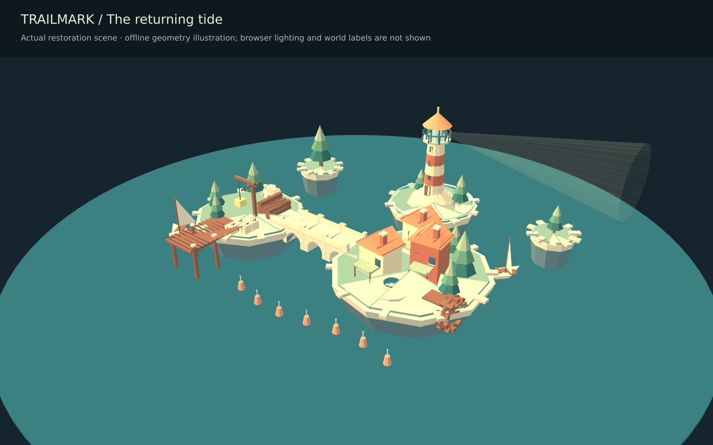](dist/packages/trailmark/README.md) **Trailmark · Every task leads somewhere** |

| Pipeline tools | Showcase |
| --- | --- |
| [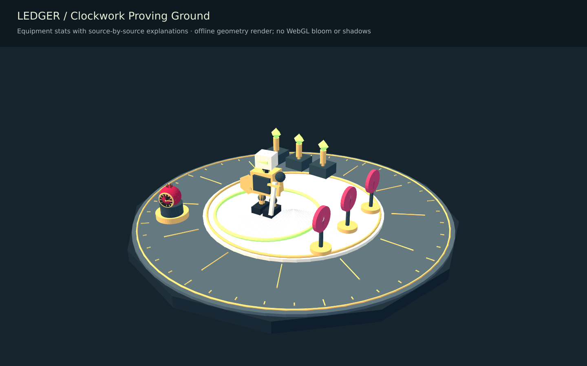](dist/packages/ledger/README.md) | **Ledger · Clockwork Proving Ground** — change equipment and see where each stat comes from. |
| [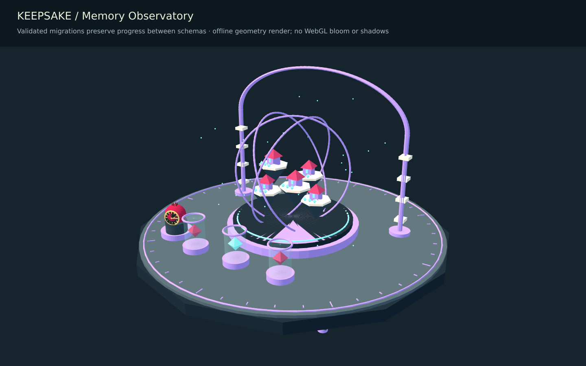](dist/packages/keepsake/README.md) | **Keepsake · Memory Observatory** — upgrade an older save and inspect what changed. |
| [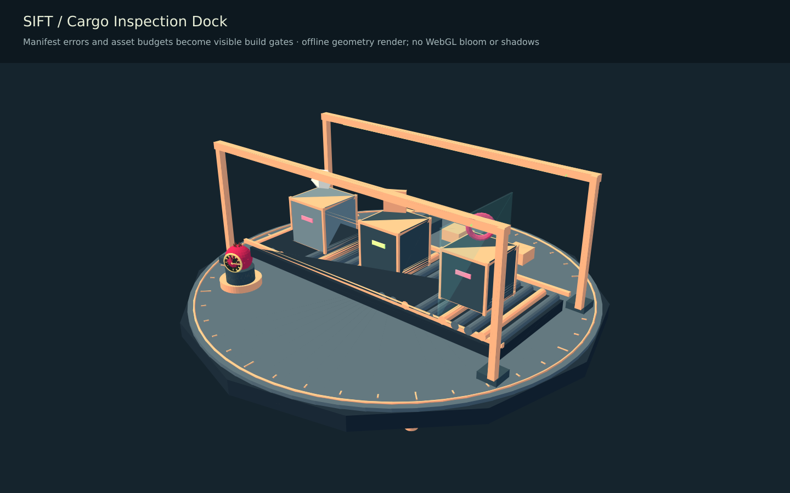](dist/packages/sift/README.md) | **Sift · Cargo Inspection Dock** — inspect asset failures and their exact causes. |

These three tools have no runtime dependencies. Each includes a runnable example, TypeScript declarations, and an integration tutorial. Look for a small CranberryClock cameo in the new showcases.

Gallery images are reproducible offline renders of the project's actual geometry and runtime state, **not browser screenshots**. Three.js SVGRenderer simplifies materials and does not reproduce browser bloom, charge shaders, or shadows. [Image methodology](docs/images/README.md).

## Game templates

### Afterglow · Outrun the last sun

[](dist/templates/afterglow/README.md)

A complete arena game combining **Signal + Flux**. Survive three escalating rounds, read charging attacks, dash through danger, and reach a win or loss. The damage checks use Signal's actual footprint API. Includes keyboard and touch controls.

[Customize Afterglow →](dist/templates/afterglow/README.md)

### Mothlight · A small light, a way home

[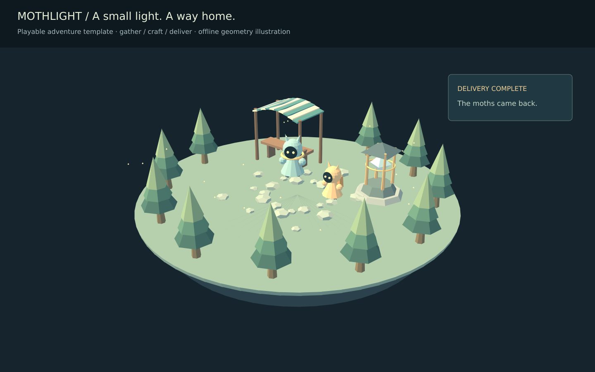](dist/templates/mothlight/README.md)

A compact adventure combining **Satchel + Chatter**. Meet Mira, gather resources, craft a lantern, and restore a beacon. Includes branching dialogue, inventory, crafting, local saves, an ending, and keyboard, click-to-travel, and touch controls.

[Customize Mothlight →](dist/templates/mothlight/README.md)

After building, extract either `dist/downloads/afterglow-template-0.1.0.tgz` or `dist/downloads/mothlight-template-0.1.0.tgz`, then run `npm start` inside. Each archive includes its selected tools, the official Three.js distribution, original procedural scenery, and a dependency-free local server.

## Designed to fit your project

- **Use real Three.js objects.** Rendering packages work with your scene, geometry, materials, and clock. They do not create another engine.
- **Keep ownership explicit.** Your game owns persistence, multiplayer authority, collision policy, and cross-system transactions.
- **Make state inspectable.** Validated snapshots, seeded generation, and explicit transitions support deterministic testing.
- **Ship on the web.** `dist/` is authored static source. The build copies the pinned official Three.js distribution; no account or backend is required by the showcases. Deploy at a static host's root, or adapt absolute asset paths for subdirectory hosting.

These are focused tools, not a full game engine. Examples of deliberate boundaries: Biome uses heightfields rather than arbitrary terrain; Wayfinder routes point agents on one grid layer; Loom does not solve road intersections; Flux is a ribbon renderer rather than a general particle system. Each guide documents the precise contract. This release targets WebGLRenderer and makes no WebGPU or cross-device FPS claim.

## Verification

```sh
npm run check          # Build, runtime tests, and TypeScript checks
npm run test:packages  # Install every tool in an isolated project
npm run test:template  # Check both portable game archives
npm run test:site      # Validate routes, assets, and module links
npm run test:privacy   # Guard against common accidental disclosures
npm run samples       # Regenerate the README gallery
```

Tests cover procedural scenes, malformed saves, atomic inventory mutations, dialogue effects and DOM cleanup, interaction reach and holds, objective progression, route optimality, full game completion, HTTP integration, and a round trip through Three.js's actual GLB exporter/loader. Browser/GPU visual QA is not claimed by these automated checks.

## Documentation

| Resource | Contents |
| --- | --- |
| [Package guides](dist/packages) | APIs, tutorials, ownership rules, and limits for every tool |
| [Template guides](dist/templates) | Game controls, structure, customization, and distribution |
| [HTTP companion](docs/HTTP_API.md) · [OpenAPI 3.1](dist/api-reference.json) | Optional local automation endpoints; not an authenticated production backend |
| [Research](docs/RESEARCH.md) | Existing alternatives, product decisions, and deferred work |
| [Contributing](CONTRIBUTING.md) · [Security](SECURITY.md) · [Changelog](CHANGELOG.md) | Project practices and release notes |

## License and credits

Original code and procedural showcase geometry: [MIT](LICENSE), CranberryClock. Three.js is redistributed unmodified with its [MIT license](https://github.com/mrdoob/three.js/blob/dev/LICENSE). Self-hosted DM Sans and Space Grotesk retain their included SIL Open Font Licenses. Built with Gizmo.
